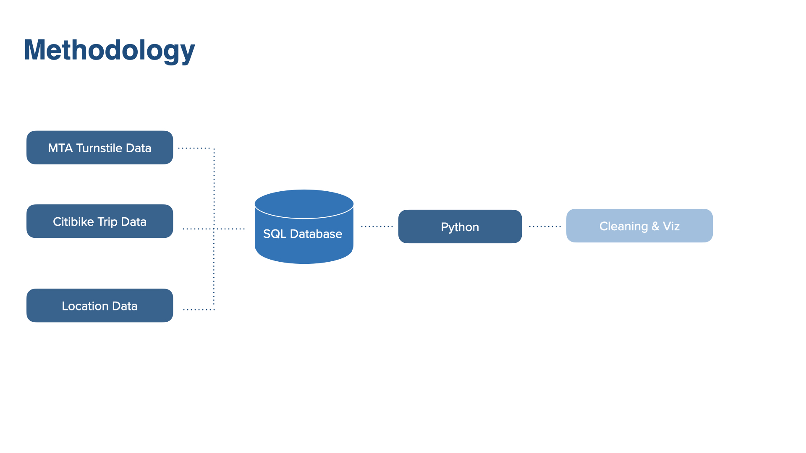
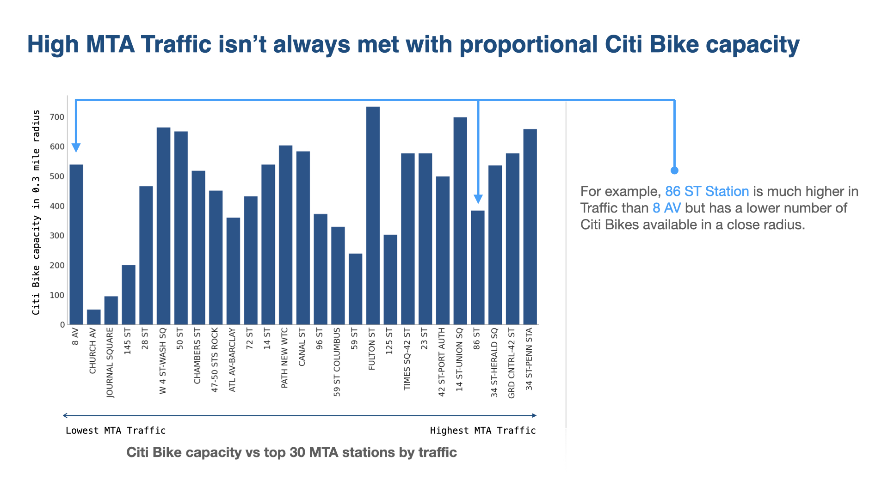
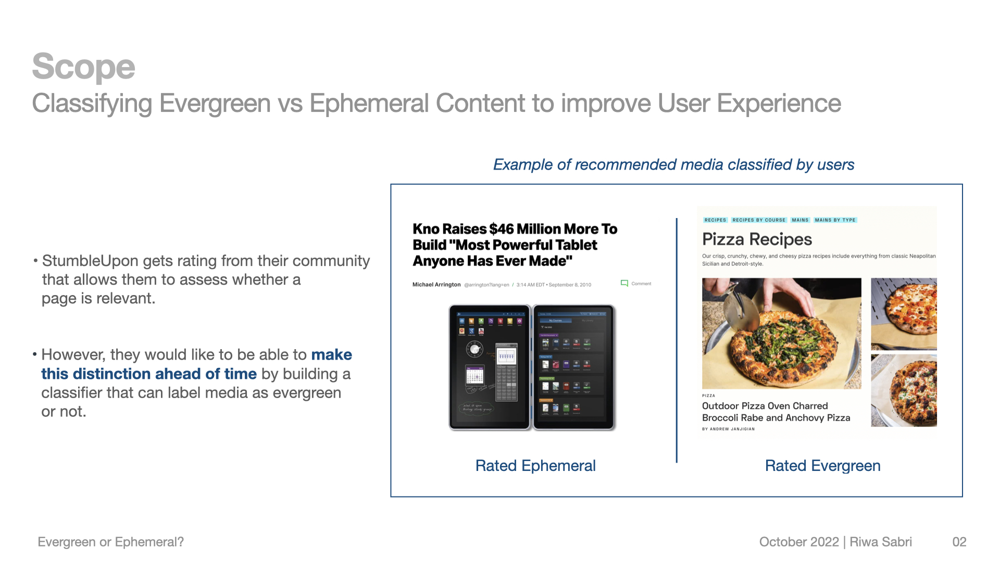
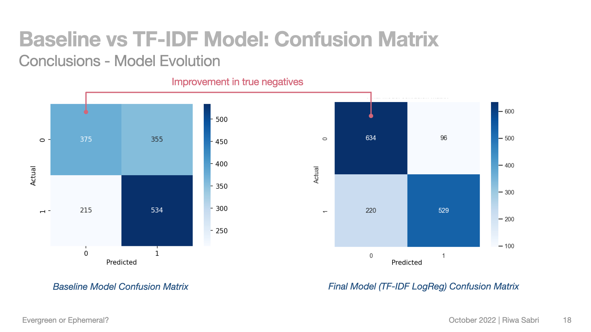
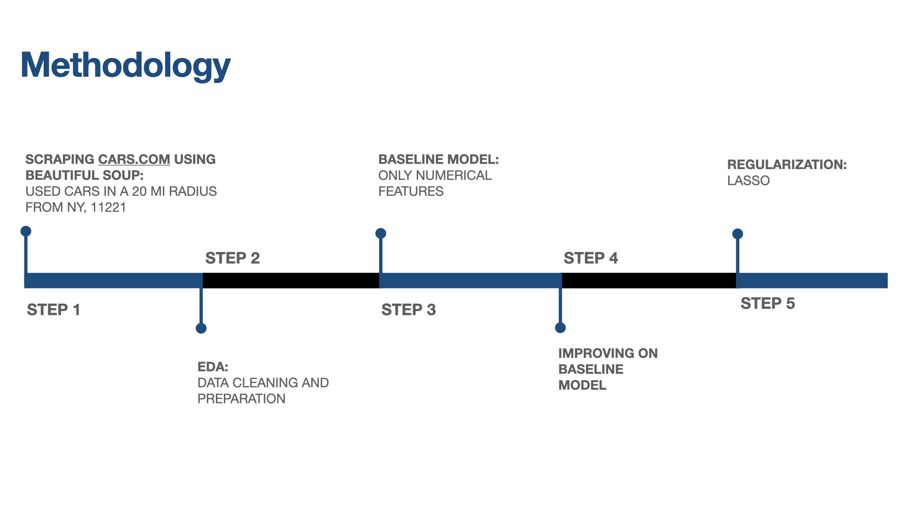
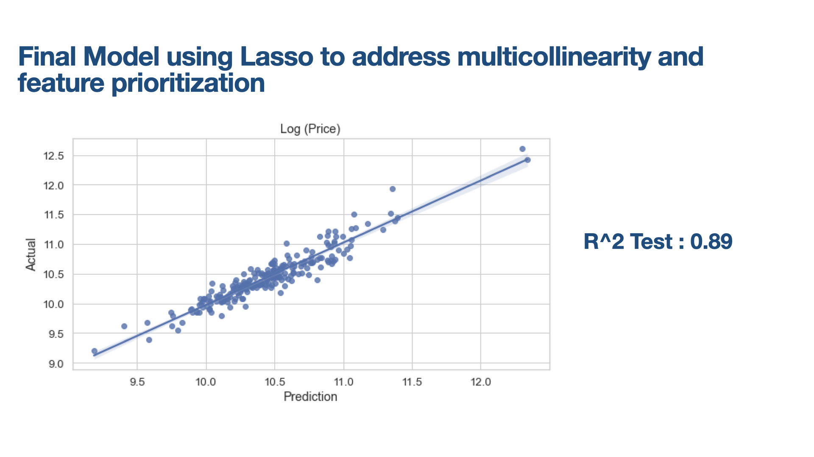
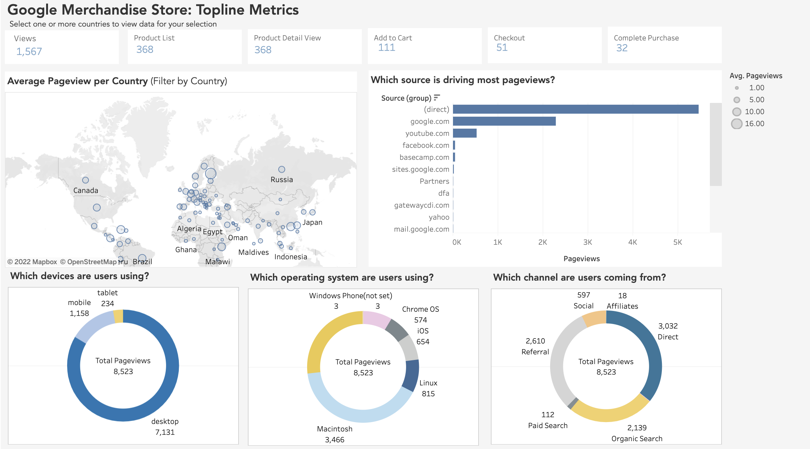

# Hi there, I'm Riwa!

Here, you'll find some of the data science projects I worked on as part of the Metis Bootcamp. 

## [A tweet recommendation functionality](https://github.com/riwasabri/A-completely-new-way-of-discovering-interesting-tweets-/)
I built a content-based tweet recommendation system that would allow users to find "related tweets" starting from any tweet. On the data science side, 
I chose two topics (nightmares, caviar customer complaints), scraped relevant tweets, and used dimensionality reduction (PCA, NMF, ...) and cosine similarity to recommend "related tweets." On the UX/UI side, I built a clickable prototype to demonstrate the new user experience.  
Tools: Pandas, Numpy, Scikit Learn, NLTK, Regex, Gensim

## [Where should Citi Bike build the next 10 bike docks?](https://github.com/riwasabri/Where-should-Citi-Bike-build-the-next-10-bike-docks-)
I combined MTA's station-level traffic data with Citi Bike's ride data to find locations with insufficient docking capacity. 
Tools used: SQLite, Pandas, NumPy, Seaborn, Matplotlib, Folium

## [How can StumbleUpon avoid surfacing stale content?](https://github.com/riwasabri/How-can-StumbleUpon-avoid-surfacing-stale-content-)
I built a classification model to predict whether an article on StumbleUpon is evergreen (timeless) or ephemeral. Compared several models using cross-validation: kNN, Logistic Regression, Random Forest, XGBoost, and Ensembling. Also implemented TF-IDF. 
Tools: Pandas, Numpy, Scikit-learn, Matplotlib, Seaborn

## [Assisting car buyers on cars.com in finding the best deals](https://github.com/riwasabri/Using-the-power-of-data-to-flip-used-cars)
I scraped Cars.com's website and then used linear regression to predict car prices and identify underpriced cars. 
Tools used: Beautiful Soup, Pandas, Scikit-learn, Statsmodel, Matplotlib, Seaborn

## [Enabling business analysts to understand complex data with interactive dashboards](https://github.com/riwasabri/Empowering-business-analysts-to-understand-complex-data-with-interactive-dashboards)
I transformed Web Analytics data from the Google Merchandise Store, and built dashboards intended to help a business user parse through this complex dataset. I also proposed a clustering approach for better customer targeting. 
Tools: Microsoft Excel, Tableau, Pandas, Scikit-learn, Matplotlib, Seaborn

## [Guessing the artist, a deep learning approach](https://github.com/riwasabri/DeepLearning)

The goal of this project is to leverage deep learning to guess the artist of a given artworks by
using images of artworks created by a variety of artists in terms of style and technique.

